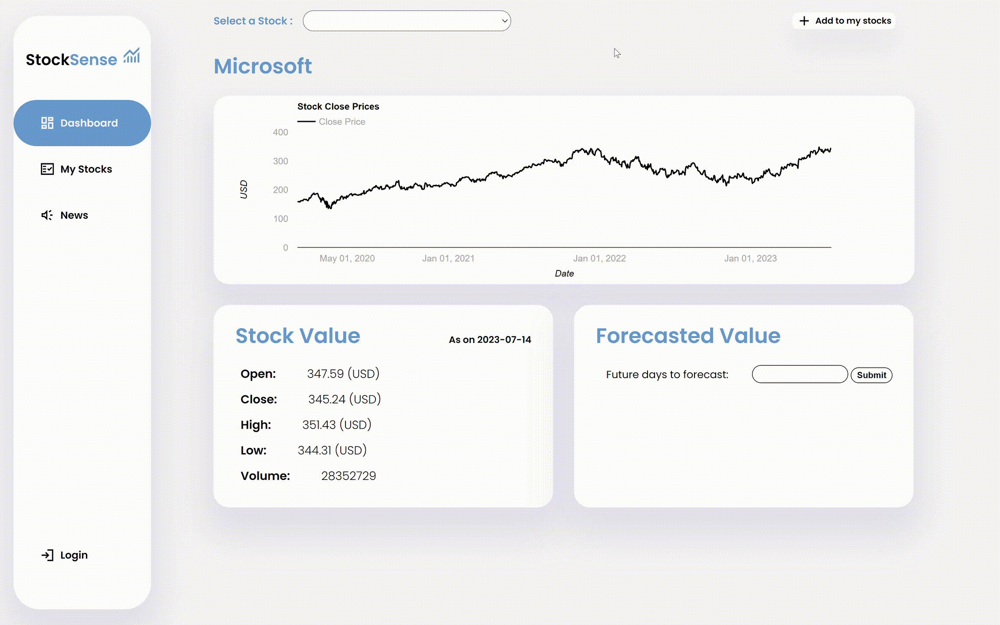
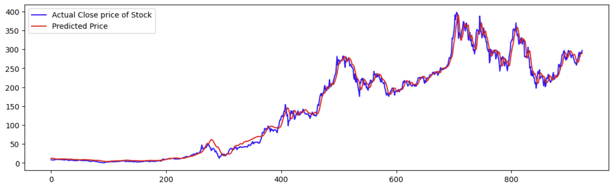
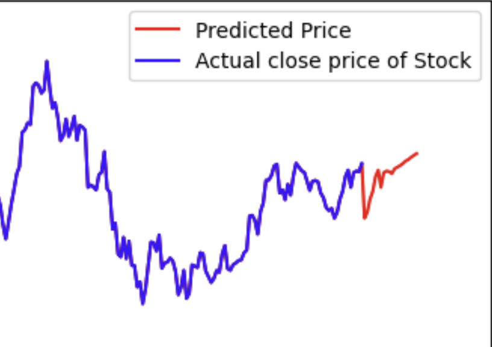

# StockSense | Smart AI Trading 📈🤖
Your ultimate AI Trading app, Elevate your trading game with precise stock price forecasts and real-time sentiment analysis of news headlines. Enjoy faster data retrieval by seamless database integration, maximizing productivity and keeping you ahead of market trends.

## Table of Contents

- [Overview](#overview)
- [User Interface](#user-interface)
- [Goals](#goals)
- [Technical Aspect](#technical-aspect)
- [Testing & Validation](#testing--validation)
- [Installation](#installation)
- [To Do](#to-do)
- [Technologies Used](#technologies-used)
- [License](#license)

## Overview

StockSense stands as a technological marvel. Its frontend harmonizes HTML, CSS, and JavaScript for a seamless user experience. Behind the scenes, the power of Stacked LSTM models accurately forecasts stock prices, while Naive Bayes NLP deciphers sentiment from news headlines. The data engine relies on Firebase for robust storage, while Flask orchestrates the backend. At the heart of it all, TensorFlow propels the AI engine, while the pandas_datareader API ensures up-to-the-minute stock data. With StockSense, the future of smart trading is here.

## User Interface

StockSense's interface is designed for effortless trading. Easily choose from 80+ stocks at the top, with an "Add to my stocks" button for personalized tracking. The central line chart offers a 2-year stock overview. Information cards below show latest data, while on the right, forecast future days.
Navigation is smooth with a sidebar for Dashboard, My Stocks, News, and Log In.

### Dashboard

  

  
### News

  

  
### Stock's List

  

## Goals

- Provide users with accurate stock price forecasts based on historical data.
- Analyze sentiment from financial news headlines to gauge market sentiment.
- Offer an intuitive user interface for easy interaction with the features.
- Combine forecasting and sentiment analysis to provide a holistic view for decision-making.

## Technical Aspect

- **Data Collection:** Utilized the `pandas_datareader` API to fetch stock price data from the past 2 years along with stock names. Cleaned and converted the data for further analysis.
- **Data Storage:** Employed the Firebase Database to store and manage collected stock data. Functions like `add_stocks_data()` to add new stocks data and `update_database()` to subsequently update the data i.e facilitated data storage and updates.
- **Web Scraping:** Implemented real-time web scraping to extract the latest top 5 headlines from `economictimes.indiatimes.com` for relevant financial news.
- **Data Science:** Trained a News Sentiment NLP Model on a dataset of over 200k headlines, achieving an accuracy of more than 76%. Employed a Multinomial Naive Bayes Classifier and validated the model's performance on real data.
- **Forecasting:** Developed a Multi Stacked LSTM-based model for stock price forecasting. The model, trained on dataset of past 12-years stock prices, demonstrated low RMSE and high accuracy.
- **Integration with Website:** Integrated the project with a Flask-based website. The website fetches stock tickers for a dropdown menu, displays stock price data using Google Charts, Forecasts stock prices and presents News Headlines with sentiment analysis results based on user queries.

## Testing & Validation 

### Forecast Model

  
    

### News Sentiment Model

  

## Installation

To set up the project locally, follow these steps:

1. Clone the repository from [here.](https://github.com/AkshaySaraf02/stock-sense).
2. Install required Python packages using `pip install -r requirements.txt`.
3. Configure Firebase credentials for data storage.
4. Run the Flask server using `python app.py`.

## To Do

- Enhance the user interface for better visualization and interaction.
- Explore additional machine learning models for sentiment analysis & forecasting and compare results.
- Implement real-time data streaming for more up-to-date stock information.

## Technologies Used

- **Frontend:** HTML, CSS, JavaScript
- **Backend:** Python, Flask
- **Database:** Firebase
- **Machine Learning:** TensorFlow, Keras, SciKit Learn
- **Web Scraping:** Beautiful Soup, requests

## License

This project is licensed under the [License Name] License. You can find more details in the `LICENSE` file.

